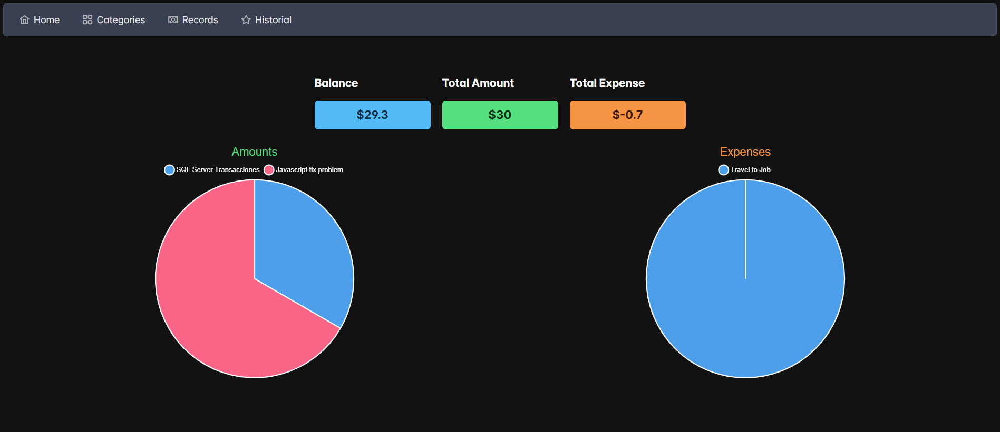
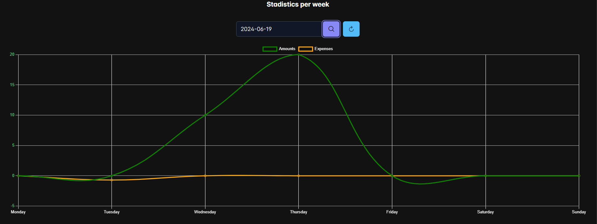
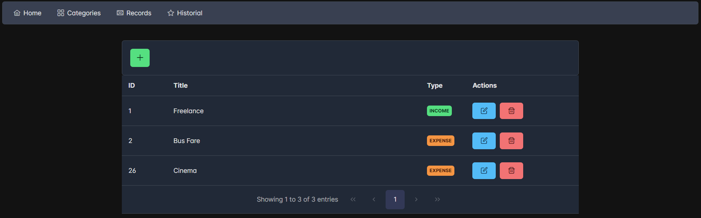
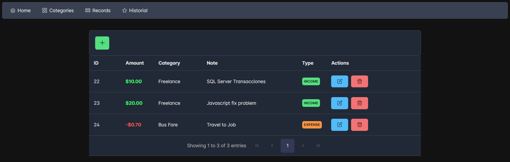
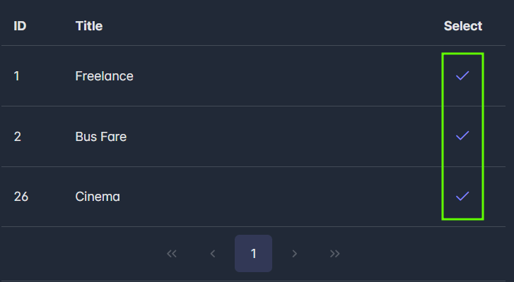
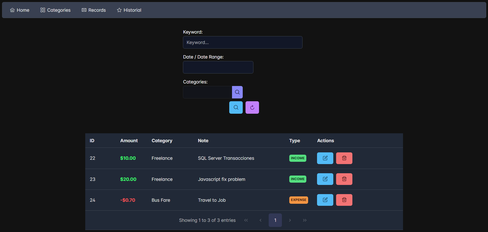
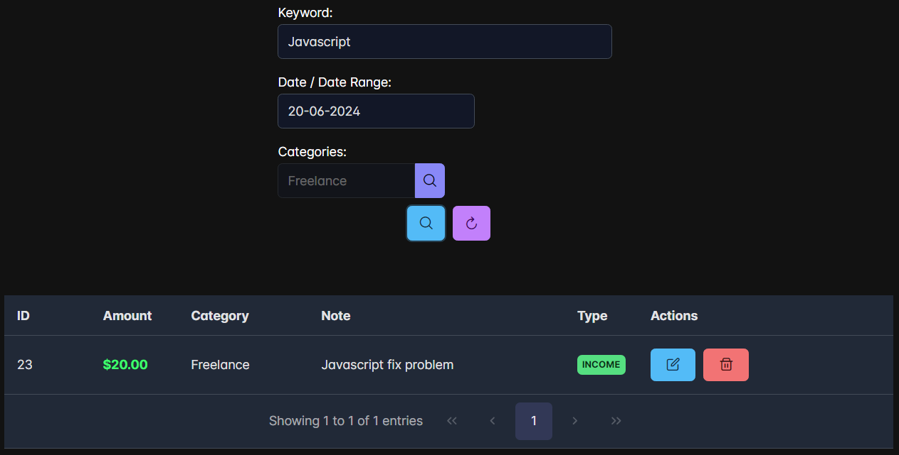

## Angular & Spring Boot Expenses Dashboard 💹

The main function of this project is to record in the easiest way your **expenses** and **incomes** 💸📉. You can now easily manage your finances. 😁 

<p align="center">
    <a href="https://spring.io/projects/spring-boot" target="blank"></a>
    <a href="https://angular.dev/" target="blank"></a>
    <a href="https://www.chartjs.org/" target="blank"></a>
    <a href="https://www.mysql.com/" target="blank"></a>
</p>


## How works? 🔧

### **Dashboard** 📈📊📉



+ **`Balance`:** Is the total money do you have (**`Amounts` - `Expenses`**)

+ The **`Amounts`** graphic show the your all amounts and the type of there.
+ The **`Expenses`** graphic show the your all expenses and the type of there. 




+ In this graphic you can see all **amount** and **expense** per day in the current week or you can choose the week do you want to know your records.


### **Categories** 🎫



+ In this section you can manage (CREATE, DELETE and UPDATE) your categories records, the categories only have two types **`INCOME`** 💹 or **`EXPENSE`** 📉

### **Records** 💲



+ In this section you can manage your records (CREATE, DELETE and UPDATE). 

+ If you want to register a new record a **category** is needed

    

### **Historial** 📃



+ In this section you can filter by `Keyword`, a `specific day` or a `range of dates` and `category`

    

---

### Docker Deploy 🐳

1. To deploy only run the command

```bash
docker-compose up
```
